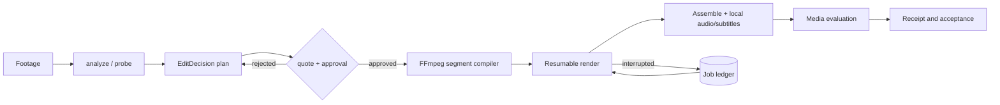

# Codex Video Factory


> Local-first shot analysis, approved edit planning, deterministic FFmpeg composition, and verified media receipts — driven from Codex.

[](https://github.com/partme-ai/codex-video-factory-plugin)
[](LICENSE)

[English](README.md) | [简体中文](README.zh-CN.md) · [Install](#installation) · [Quick start](#quick-start) · [Commands](#command-contract) · [Troubleshooting](#troubleshooting)

## Positioning

`codex-video-factory` turns existing footage into an approved, verifiable edit. Codex analyzes shots, proposes an edit decision, asks for your approval per stage, renders through local FFmpeg, and records a receipt for every output file. There is no cloud service, no API key, and no vendor upload.

The repository keeps the canonical `video` spelling across repository, plugin, package, CLI, and Skill identifiers.

### Who it is for

- Editors and content teams who want an auditable rough cut instead of an opaque export.
- Engineers who need deterministic, scriptable video composition with resumable jobs.
- Reviewers who need a receipt chain proving which inputs produced which output.

### What problem it solves

| Problem | What this plugin provides | Verifiable entry point |
|---|---|---|
| Edits are hard to reproduce | A closed `EditDecision` compiled to FFmpeg argv | `bin/video-factory validate-plan`, `src/ffmpeg-compiler.mjs` |
| Cost and approval blur together | Quote-then-approve gates bound to content hashes | `bin/video-factory quote` / `run --approval` |
| Long renders die halfway | A durable ledger with per-segment resume | `bin/video-factory recover`, `src/job-ledger.mjs` |
| Outputs are unverified claims | Media probes and acceptance receipts per file | `bin/video-factory evaluate` / `accept` |

## At a glance

```text
Footage + intent
      │
      ▼
┌──────────────────────────────────────────────────────────┐
│ codex-video-factory                                      │
│  ① analyze       probe media, cut points, shot semantics │
│  ② plan          validate a closed EditDecision          │
│  ③ quote         enumerate work and bind the approval    │
│  ④ run           render resumable FFmpeg segments        │
│  ⑤ review-sync   build the picture + shot-data review    │
│  ⑥ evaluate      media quality gates and receipts        │
└──────────────────────────────────────────────────────────┘
      │
      ▼
Rough cut / final cut (H.264 + AAC MP4) + receipts
```

| Property | Value |
|---|---|
| Plugin ID | `codex-video-factory` |
| Host | Codex CLI or ChatGPT desktop app |
| Current version | `0.1.0` |
| Plugin manifest | `.codex-plugin/plugin.json` |
| MCP configuration | none — this plugin exposes a Skill-driven CLI, not an MCP server |
| Primary language | Node.js (ESM), zero runtime dependencies |
| License | Apache-2.0 |

## Capabilities and boundaries

### Supported

| Capability | Input | Output | Limit | Status |
|---|---|---|---|---|
| Shot analysis | A source video | `shots.json`, track, frames, report | Bounded by the local probe and Codex review | Stable |
| Edit planning | Local assets + intent | A closed `EditDecision` | Local regular files under `--input-root` only | Stable |
| Rough cut | Approved plan + quote | Resumable H.264 MP4 | Approval binds plan/edit/round/quote hashes | Stable |
| Synchronized review | Rendered cut + shot data | Internal review MP4 | Chrome needed only for the enhanced view | Stable |
| Final composition | Approved final plan | Final MP4 with local audio and subtitles | FFmpeg 9.0.1 lacks libass, so subtitle burn-in is recorded as `SKIPPED` | Stable with a known gap |
| Job recovery | An interrupted ledger | Resumed pending segments | Completed segments are never re-rendered | Stable |

### Not responsible for

- Generating video with a remote model. Native video generation stays explicitly blocked in 0.1.0, and the plugin must not silently switch to an API, a web UI, or a third-party vendor.
- Producing images or controlling Blender. Image Factory and the Blender plugin deliver authorized, hashed assets that this plugin consumes.
- Hosting a graphical studio, project management, or a review surface. PartMe Studio owns those.
- Judging semantic consistency: it is recorded as `NOT_RUN` and left to Codex or human review, never disguised as a deterministic PASS.

### Maturity

| Status | Meaning |
|---|---|
| Stable | Automated tests plus a deterministic gate; usable for real work |
| Stable with a known gap | Works, but a documented sub-feature is skipped |
| Blocked / NOT_RUN | Deliberately not implemented; must not be presented as available |

## Architecture and core flow



### Component responsibilities

| Component | Owns | Does not own |
|---|---|---|
| `src/cli.mjs` | Command dispatch, exit codes, argument validation | Media processing |
| `src/orchestrator.mjs` | Run, approve, and recover sequencing | FFmpeg argv construction |
| `src/ffmpeg-compiler.mjs` | Deterministic argv and content-addressed segment keys | Approval decisions |
| `src/job-ledger.mjs` | Durable state, atomic writes, resume points | Render execution |
| `src/approval.mjs` | Binding an approval to stage, plan, edit, round, and quote hashes | Cost estimation |
| `skills/` (7) | Routing, planning, review, and recovery instructions for Codex | Runtime behaviour |

## Compatibility

| Plugin version | Host | Runtime | Status |
|---|---|---|---|
| `0.1.0` | Codex CLI or ChatGPT desktop app | Node.js 18+, FFmpeg and ffprobe on `PATH` | Verified locally |
| `0.1.0` | Codex CLI or ChatGPT desktop app | Chrome or Chromium for the enhanced `video-sync` view | Optional |

CI exercises Node 18 and Node 24. Any platform with Node and FFmpeg works; the recorded verification evidence was produced on macOS.

## Installation

### From the plugin marketplace

```bash
codex plugin marketplace add partme-ai/codex-video-factory-plugin --ref main
codex plugin add codex-video-factory@partme-ai-video-factory
```

Restart Codex or the ChatGPT desktop app, then open a new task so the Skills load.

### From source

```bash
git clone https://github.com/partme-ai/codex-video-factory-plugin.git
cd codex-video-factory-plugin
bin/video-factory probe
```

There is no build step and no `npm install`: the CLI has zero runtime dependencies.

### Confirm it loaded

```bash
codex plugin list
```

Expected entry:

```text
codex-video-factory@partme-ai-video-factory  installed, enabled
```

Then confirm the local runtime:

```bash
bin/video-factory probe
```

Expected result: a JSON report for Node, FFmpeg, and ffprobe availability, plus whether the enhanced review path is usable.

## Quick start

### 1. Prerequisites

- Node.js 18 or newer on `PATH`.
- FFmpeg and ffprobe on `PATH` (required for every render and probe).
- Chrome or Chromium only if you want the enhanced synchronized review video.
- Your footage as local regular files; the plugin never fetches a URL.

### 2. Analyze the source

```bash
bin/video-factory analyze source.mp4 --out reelbench-analysis
```

Codex then annotates `shots.json` with the vendored `video-shots` Skill, and you finalize the analysis:

```bash
bin/video-factory analyze-finalize reelbench-analysis/shots.json \
  --track reelbench-analysis/track.json --frames reelbench-analysis/frames
```

### 3. Plan, quote, and approve the rough cut

```bash
bin/video-factory validate-plan video-plan.json
bin/video-factory quote video-plan.json --stage rough
bin/video-factory run video-plan.json --stage rough --approval rough-approval.json
```

An approval binds the stage, plan hash, edit hash, round, and quote revision. Any change to an asset, an edit, or an output specification invalidates the old approval.

### 4. Review and finish

```bash
bin/video-factory review-sync output/rough.mp4 reelbench-analysis/shots.json
bin/video-factory quote video-plan.json --stage final
bin/video-factory run video-plan.json --stage final --approval final-approval.json
bin/video-factory accept final-job.json --decision approved --note "played and accepted"
```

The rough cut and the final cut are approved separately. A rejected stage returns to planning with the previous approval discarded.

## Command contract

| Command | Purpose | Notable flags |
|---|---|---|
| `probe` | Report Node, FFmpeg, and Chrome availability without touching footage | — |
| `analyze` | Probe footage and emit shot-analysis inputs | `--out` |
| `analyze-finalize` | Merge Codex annotations into the analysis | `--track`, `--frames` |
| `validate-plan` | Validate a closed `EditDecision` | — |
| `quote` | Enumerate work for a stage and return a quote revision | `--stage rough\|final` |
| `run` | Render a stage | `--stage`, `--approval` |
| `review-sync` | Build the picture-plus-shot-data review video | — |
| `status` | Read current job state from the ledger | `--ledger` |
| `evaluate` | Run media quality gates over the outputs | — |
| `accept` | Record the human acceptance decision | `--decision`, `--note` |
| `recover` | Resume pending segments after an interruption | `--ledger` |

### Stable exit codes

| Exit | Meaning | Suggested action |
|---|---|---|
| `0` | Success | Continue |
| `1` | General error | Read the message and fix the input |
| `2` | Unknown command | Correct the command |
| `3` | Only local composition is supported | Do not attempt remote generation |
| `4` | Approval error | Re-quote and approve the new revision |

## Retry, idempotency, and recovery

- No automatic retry. A failed segment is reported as failed; the source states plainly that a silent retry is how one bad prompt becomes a large bill.
- Approvals are single-use and hash-bound. Changing an asset, an edit decision, or an output spec invalidates the previous approval instead of silently reusing it.
- Segment work is content-addressed, so re-running a plan never re-renders a completed segment.
- `recover` resumes only the pending segments recorded in the ledger.
- Inputs must be regular files beneath `--input-root` and match their recorded SHA-256. Network URLs, path traversal, symlink escapes, special files, arbitrary FFmpeg expressions, and credential fields are all rejected.

## Data and state

| Data | Location | Lifecycle | Secrets |
|---|---|---|---|
| Job ledger | `<plan>.job.json`, or the `--ledger` path | Until the job is accepted or discarded | None |
| Per-segment state | Inside the ledger | Updated atomically (write, fsync, rename) | None |
| Render outputs | The output directory you choose | Until you delete them | None |
| Source assets | Your local directories | Untouched | None |

The ledger is a plain JSON file, so you can inspect, archive, or delete it with ordinary tools. There is no database and no hidden state directory.

## Security

- No API key, token, or credential exists anywhere in this plugin, and the runtime never reads one.
- No network call is made for generation. Local FFmpeg is the only execution engine.
- Approvals bind to content hashes, so an approval cannot be replayed against different content.
- Input containment rejects paths outside `--input-root`, symlink escapes, and special files.
- The plugin provides no graphical studio, generates no images, controls no Blender, and calls no external video API.

## Development and verification

```bash
node --test tests/*.test.mjs
```

Evidence recorded in this repository:

- [Offline verification](docs/verification/offline.md) — what passes without network access, including `Native video generation keeps NOT_RUN`.
- [Runtime verification](docs/verification/runtime.md) — measured behaviour, including the `SKIPPED` subtitle note and the `NOT_RUN` semantic-consistency line.
- [Code review](docs/verification/code-review.md) and [TRACE report](docs/verification/trace-report.md).
- [ReelBench license review](docs/compliance/reelbench-license-review.md) for the vendored Skills.

## Troubleshooting

| Symptom | Check first | Resolution |
|---|---|---|
| `probe` reports a missing tool | FFmpeg and ffprobe on `PATH` | Install FFmpeg and re-run `probe` |
| Plan validation fails | `EditDecision` schema | Fix the plan; the validator names the offending field |
| Run refuses to start | The approval file | Re-run `quote` for the stage and approve the new revision |
| Render stops mid-way | Ledger state | Run `recover`; completed segments are never re-rendered |
| Review video is unavailable | Chrome presence | Install Chrome, or skip the enhanced review |
| Subtitle burn-in is missing | The local FFmpeg build | The bundled FFmpeg 9.0.1 has no libass filter; the step is recorded as `SKIPPED` |
| A remote generation path was expected | Plugin scope | Native video generation is blocked in 0.1.0 by design |

## Project structure

```text
codex-video-factory-plugin/
├── .codex-plugin/plugin.json   # plugin identity and presentation metadata
├── .agents/plugins/marketplace.json
├── bin/video-factory           # CLI entry point
├── src/                        # CLI, orchestrator, compiler, ledger, approval
├── skills/                     # 5 factory Skills + 2 vendored ReelBench Skills
├── tests/                      # node:test suites, including distribution checks
└── docs/                       # design spec, CLI recipes, verification records
```

## Deep links

- [Architecture and design specification](docs/superpowers/specs/2026-09-14-codex-video-factory-plugin-design.md)
- [Implementation plan](docs/superpowers/plans/2026-09-14-local-composition-v0.1.0.md)
- [CLI recipes (中文)](docs/guides/current-cli-recipes.zh-CN.md)
- [Third-party notices](THIRD_PARTY_NOTICES.md)

## Contributing and support

Open functional issues at <https://github.com/partme-ai/codex-video-factory-plugin/issues>. Before proposing a change, state the target Node version and whether it alters the approval binding or the ledger format, and include the affected tests.

## License

Apache-2.0 — see [LICENSE](LICENSE).
