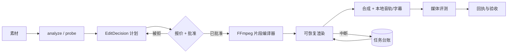

# Video Factory


> 本地优先的拉片分析、经批准的剪辑规划、确定性的 FFmpeg 合成，以及可核验的媒体回执——由受支持的编码智能体驱动。

[](https://github.com/full-aigc-plugins/video-factory-plugin/releases/tag/v0.1.5)
[](LICENSE)

[English](README.md) | [简体中文](README.zh-CN.md) · [安装](#安装) · [快速开始](#快速开始) · [命令契约](#命令契约) · [故障排查](#故障排查)

## 项目定位

`video-factory` 把已有素材变成一次经批准、可核验的剪辑。宿主智能体先分析镜头，再提出剪辑决策，按阶段征求你的批准，通过本地 FFmpeg 渲染，并为每个输出文件生成回执。全程没有云服务、没有 API Key、也不做供应商上传。

仓库、插件、包、CLI 与 Skill 标识统一使用规范的 `video` 拼写。

### 适合谁

- 需要可审计粗剪、而不是黑盒导出的剪辑师与内容团队。
- 需要确定性、可脚本化且可断点恢复的视频合成流程的工程师。
- 需要回执链来证明"哪份输入产出了哪份输出"的审阅者。

### 解决什么问题

| 问题 | 本插件提供 | 可验证入口 |
|---|---|---|
| 剪辑难以复现 | 封闭的 `EditDecision` 编译为确定的 FFmpeg argv | `bin/video-factory validate-plan`、`src/ffmpeg-compiler.mjs` |
| 花费与批准混在一起 | 报价-批准门禁绑定到内容哈希 | `bin/video-factory quote` / `run --approval` |
| 长任务中途失败 | 可持久化台账与逐段恢复 | `bin/video-factory recover`、`src/job-ledger.mjs` |
| 输出只是口头承诺 | 每个输出文件的媒体探测与验收回执 | `bin/video-factory evaluate` / `accept` |

## 一眼看懂

```text
素材 + 意图
      │
      ▼
┌──────────────────────────────────────────────────────────┐
│ video-factory                                      │
│  ① analyze       探测媒体、切点与镜头语义                │
│  ② plan          校验封闭的 EditDecision                 │
│  ③ quote         枚举工作量并绑定批准                    │
│  ④ run           可恢复地渲染 FFmpeg 片段                │
│  ⑤ review-sync   生成画面 + 镜头数据的审阅视频           │
│  ⑥ evaluate      媒体质量门禁与回执                      │
└──────────────────────────────────────────────────────────┘
      │
      ▼
粗剪 / 终版（H.264 + AAC MP4）+ 回执
```

| 项目属性 | 值 |
|---|---|
| 插件 ID | `video-factory` |
| 宿主 | Codex CLI 或 ChatGPT 桌面应用 |
| 当前版本 | `0.1.5` |
| 插件清单 | `.codex-plugin/plugin.json` |
| MCP 配置 | 无——本插件提供由 Skill 驱动的 CLI，而非 MCP 服务器 |
| 主要语言 | Node.js（ESM），零运行依赖 |
| 许可证 | Apache-2.0 |

## 能力与边界

### 已支持

| 能力 | 输入 | 输出 | 限制 | 状态 |
|---|---|---|---|---|
| 拉片分析 | 一个源视频 | `shots.json`、track、frames、报告 | 受本地探测与 Codex 审查范围约束 | 稳定 |
| 剪辑规划 | 本地素材 + 意图 | 封闭的 `EditDecision` | 仅限 `--input-root` 下的本地常规文件 | 稳定 |
| 粗剪 | 已批准的计划 + 报价 | 可恢复的 H.264 MP4 | 批准绑定 plan/edit/round/quote 哈希 | 稳定 |
| 同步审阅 | 已渲染的剪辑 + 镜头数据 | 内部审阅 MP4 | 增强视图需要 Chrome | 稳定 |
| 终版合成 | 已批准的终版计划 | 含本地音轨与字幕的终版 MP4 | 本地 FFmpeg 9.0.1 无 libass，字幕烧录记为 `SKIPPED` | 稳定但有已知缺口 |
| 任务恢复 | 中断后的台账 | 续跑待处理片段 | 已完成片段绝不重渲 | 稳定 |

### 不负责

- 使用远端模型生成视频。0.1.0 明确封锁原生视频生成，插件不得悄悄切换到 API、网页或第三方供应商。
- 生成图片或控制 Blender。Image Factory 与 Blender 插件交付经过授权的带哈希素材，由本插件消费。
- 提供图形工作台、项目管理或审阅界面。这些由 PartMe Studio 负责。
- 判断语义一致性：该项记录为 `NOT_RUN`，交由 Codex 或人工审阅，绝不伪装成确定性 PASS。

### 成熟度

| 状态 | 含义 |
|---|---|
| 稳定 | 有自动化测试和确定性门禁，可用于真实工作 |
| 稳定但有已知缺口 | 可用，但某个已记录的子功能被跳过 |
| 封锁 / NOT_RUN | 有意未实现，不得描述为可用 |

## 架构与核心流程



### 组件职责

| 组件 | 负责 | 不负责 |
|---|---|---|
| `src/cli.mjs` | 命令分发、退出码、参数校验 | 媒体处理 |
| `src/orchestrator.mjs` | run/approve/recover 的时序编排 | FFmpeg argv 构造 |
| `src/ffmpeg-compiler.mjs` | 确定性 argv 与内容寻址的片段键 | 批准决策 |
| `src/job-ledger.mjs` | 持久状态、原子写、恢复点 | 渲染执行 |
| `src/approval.mjs` | 把批准绑定到 stage/plan/edit/round/quote 哈希 | 成本估算 |
| `skills/`（7 个） | 供 Codex 使用的路由、规划、审阅与恢复指令 | 运行时行为 |

## 兼容性

| 插件版本 | 宿主 | 运行环境 | 状态 |
|---|---|---|---|
| `0.1.0` | Codex CLI 或 ChatGPT 桌面应用 | Node.js 18+，`PATH` 上有 FFmpeg 与 ffprobe | 本地已验证 |
| `0.1.0` | Codex CLI 或 ChatGPT 桌面应用 | 增强 `video-sync` 视图需要 Chrome 或 Chromium | 可选 |

CI 覆盖 Node 18 与 Node 24。任何具备 Node 与 FFmpeg 的平台都可用；已记录的验证证据产自 macOS。

## 安装

### 从插件市场安装

```bash
codex plugin marketplace add full-aigc-plugins/video-factory-plugin --ref v0.1.5
codex plugin add video-factory@partme-ai-video-factory
```

重启 Codex 或 ChatGPT 桌面应用，然后新建任务以加载 Skills。

### 从源码安装

```bash
git clone https://github.com/full-aigc-plugins/video-factory-plugin.git
cd partme-video-factory
bin/video-factory probe
```

无需构建、无需 `npm install`：CLI 零运行依赖。

### 确认加载成功

```bash
codex plugin list
```

预期条目：

```text
video-factory@partme-ai-video-factory  installed, enabled
```

再确认本地运行环境：

```bash
bin/video-factory probe
```

预期结果：一份 JSON 报告，说明 Node、FFmpeg、ffprobe 的可用性，以及增强审阅路径是否可用。

### 国内镜像（AtomGit）

如果 GitHub 访问缓慢或不可达，可改用 AtomGit 镜像安装。命令完全一致，只把市场地址换成镜像：

```bash
codex plugin marketplace add https://atomgit.com/partme-ai/partme-video-factory.git --ref main
codex plugin add video-factory@partme-ai-video-factory
```

如需一步安装 partme-ai 全部插件目录：

```bash
codex plugin marketplace add https://atomgit.com/partme-ai/plugins.git
codex plugin add video-factory@partme-ai-video-factory
```

注意事项：

- AtomGit 源与 GitHub 源共用市场名，后添加的会覆盖先添加的。切回官方源执行
  `codex plugin marketplace add https://github.com/partme-ai/plugins.git`。
- ZCode 与 Kimi 用户可先将镜像仓库克隆到本地，再在各平台的 marketplace 配置中登记本地目录。

## 快速开始

### 1. 前置条件

- `PATH` 上有 Node.js 18 或更新版本。
- `PATH` 上有 FFmpeg 与 ffprobe（每次渲染与探测都需要）。
- 只有需要增强同步审阅视频时才需要 Chrome 或 Chromium。
- 素材需为本机常规文件；插件不会去抓取 URL。

### 2. 分析源素材

```bash
bin/video-factory analyze source.mp4 --out reelbench-analysis
```

随后由 Codex 使用内置的 `video-shots` Skill 标注 `shots.json`，你再固化分析结果：

```bash
bin/video-factory analyze-finalize reelbench-analysis/shots.json \
  --track reelbench-analysis/track.json --frames reelbench-analysis/frames
```

### 3. 规划、报价并批准粗剪

```bash
bin/video-factory validate-plan video-plan.json
bin/video-factory quote video-plan.json --stage rough
bin/video-factory run video-plan.json --stage rough --approval rough-approval.json
```

每次批准都会绑定 stage、plan hash、edit hash、round 与报价 revision。任何素材、剪辑或输出规格的变动都会让旧批准失效。

### 4. 审阅并收尾

```bash
bin/video-factory review-sync output/rough.mp4 reelbench-analysis/shots.json
bin/video-factory quote video-plan.json --stage final
bin/video-factory run video-plan.json --stage final --approval final-approval.json
bin/video-factory accept final-job.json --decision approved --note "已播放并确认"
```

粗剪与终版分别批准。被拒的阶段会回到规划，并丢弃上一次批准。

## 命令契约

| 命令 | 用途 | 主要参数 |
|---|---|---|
| `probe` | 在不触碰素材的前提下报告 Node、FFmpeg、Chrome 可用性 | — |
| `analyze` | 探测素材并输出拉片分析输入 | `--out` |
| `analyze-finalize` | 把 Codex 的标注合并进分析结果 | `--track`、`--frames` |
| `validate-plan` | 校验封闭的 `EditDecision` | — |
| `quote` | 为某个阶段枚举工作量并返回报价 revision | `--stage rough\|final` |
| `run` | 渲染某个阶段 | `--stage`、`--approval` |
| `review-sync` | 生成画面与镜头数据的同步审阅视频 | — |
| `status` | 从台账读取当前任务状态 | `--ledger` |
| `evaluate` | 对输出运行媒体质量门禁 | — |
| `accept` | 记录人工验收决定 | `--decision`、`--note` |
| `recover` | 中断后续跑待处理片段 | `--ledger` |

### 稳定退出码

| 退出码 | 含义 | 建议动作 |
|---|---|---|
| `0` | 成功 | 继续 |
| `1` | 一般错误 | 阅读消息并修正输入 |
| `2` | 未知命令 | 修正命令 |
| `3` | 仅支持本地合成 | 不要尝试远端生成 |
| `4` | 批准错误 | 重新报价并批准新的 revision |

## 重试、幂等与恢复

- 不做自动重试。失败的片段会如实报告为失败；源码中明确写道：静默重试就是"一个坏提示词变成一张大账单"的成因。
- 批准是一次性且哈希绑定的。改动素材、剪辑决策或输出规格会让旧批准失效，而不是被悄悄复用。
- 片段工作采用内容寻址，因此重跑计划绝不会重渲已完成的片段。
- `recover` 只续跑台账中记录的待处理片段。
- 输入必须是 `--input-root` 之下的常规文件，且 SHA-256 必须匹配。网络 URL、路径穿越、符号链接逃逸、特殊文件、任意 FFmpeg 表达式与凭据字段都会被拒绝。

## 数据与状态

| 数据 | 位置 | 生命周期 | 是否含秘密 |
|---|---|---|---|
| 任务台账 | `<plan>.job.json` 或 `--ledger` 指定路径 | 直到任务被验收或丢弃 | 否 |
| 逐段状态 | 台账内部 | 原子更新（write、fsync、rename） | 否 |
| 渲染产物 | 你指定的输出目录 | 直到你删除 | 否 |
| 源素材 | 你的本地目录 | 不被改动 | 否 |

台账就是普通 JSON 文件，可用常规工具查看、归档或删除。没有数据库，也没有隐藏状态目录。

## 安全

- 本插件不含任何 API Key、Token 或凭据，运行时也不会读取。
- 生成过程不发起任何网络请求；本地 FFmpeg 是唯一执行引擎。
- 批准绑定内容哈希，因此无法把一次批准重放到不同内容上。
- 输入边界会拒绝 `--input-root` 之外的路径、符号链接逃逸与特殊文件。
- 插件不提供图形工作台、不生成图片、不控制 Blender，也不调用外部视频 API。

## 开发与验证

```bash
node --test tests/*.test.mjs
```

仓库中已记录的证据：

- [离线验证](docs/verification/offline.md)——无网络环境下通过的项目，其中包含 `Native video generation keeps NOT_RUN`。
- [运行期验证](docs/verification/runtime.md)——实测行为，包含 `SKIPPED` 字幕说明与 `NOT_RUN` 语义一致性条目。
- [代码复审](docs/verification/code-review.md) 与 [TRACE 报告](docs/verification/trace-report.md)。
- 内置 Skill 的 [ReelBench 许可证复核](docs/compliance/reelbench-license-review.md)。

## 故障排查

| 现象 | 优先检查 | 处理方式 |
|---|---|---|
| `probe` 报告缺少工具 | `PATH` 上的 FFmpeg 与 ffprobe | 安装 FFmpeg 后重跑 `probe` |
| 计划校验失败 | `EditDecision` schema | 修正计划；校验器会指出有问题的字段 |
| 运行拒绝启动 | 批准文件 | 对该阶段重跑 `quote` 并批准新的 revision |
| 渲染中途停止 | 台账状态 | 执行 `recover`；已完成片段绝不重渲 |
| 审阅视频不可用 | 是否存在 Chrome | 安装 Chrome，或跳过增强审阅 |
| 字幕未烧录 | 本地 FFmpeg 构建 | 内置的 FFmpeg 9.0.1 没有 libass 滤镜，该步骤记为 `SKIPPED` |
| 期望有远端生成路径 | 插件边界 | 0.1.0 有意封锁原生视频生成 |

## 项目结构

```text
partme-video-factory/
├── .codex-plugin/plugin.json   # 插件身份与展示元数据
├── .agents/plugins/marketplace.json
├── bin/video-factory           # CLI 入口
├── src/                        # CLI、编排、编译器、台账、批准
├── skills/                     # 5 个工厂 Skill + 2 个内置 ReelBench Skill
├── tests/                      # node:test 套件，含分发校验
└── docs/                       # 设计规格、CLI 手册、验证记录
```

## 深入文档

- [Architecture](docs/Video-Factory-Plugin-Architecture.md) · [架构文档](docs/Video-Factory-Plugin-Architecture.zh_CN.md)
- [架构与设计规格](docs/superpowers/specs/2026-09-14-video-factory-plugin-design.md)
- [实施计划](docs/superpowers/plans/2026-09-14-local-composition-v0.1.0.md)
- [CLI 实操手册（中文）](docs/guides/current-cli-recipes.zh-CN.md)
- [第三方声明](THIRD_PARTY_NOTICES.md)

## 贡献与支持

功能问题请提交到 <https://github.com/full-aigc-plugins/video-factory-plugin/issues>。提交变更前，请说明目标 Node 版本、是否改动批准绑定或台账格式，并附上受影响的测试。

## 许可证

Apache-2.0，见 [LICENSE](LICENSE)。
