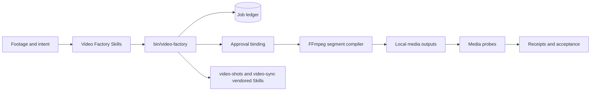
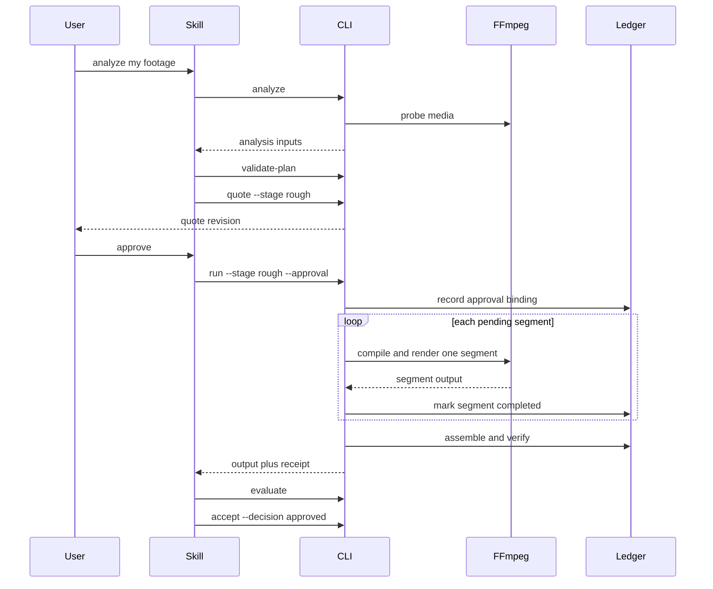

# Codex Video Factory Plugin Architecture

> **Document control**
>
> | Field | Value |
> |---|---|
> | Status | Implemented for `0.1.0`; native video generation is blocked by design |
> | Scope | How the plugin turns footage into an approved, resumable, verified edit |
> | Audience | Maintainers, reviewers, and integrators of this plugin |
> | Out of scope | Remote video generation, a graphical studio, and project management |
> | Runtime evidence | [docs/verification/runtime.md](verification/runtime.md) |
> | Last structural revision | 2026-09-14 |

[English](Codex-Video-Factory-Plugin-Architecture.md) | [简体中文](Codex-Video-Factory-Plugin-Architecture.zh_CN.md)

## 1. Executive summary

`codex-video-factory` turns existing footage into an approved, verifiable edit. Codex analyzes shots, proposes an edit decision, asks for approval per stage, renders through local FFmpeg, and records a receipt for every output file. There is no cloud service, no API key, and no vendor upload.

The architecture exists to make three guarantees enforceable: an edit cannot be reproduced from a chat log, so it is a document; a render cannot be trusted from an exit code, so it is verified; and a long render cannot be restarted from zero, so it resumes.

## 2. Drivers and constraints

| Driver | Consequence for the architecture |
|---|---|
| Edits must be reproducible | A closed `EditDecision` compiled to deterministic FFmpeg argv |
| Spending and approval must not blur | A free quote step, then an approval bound to content hashes |
| Renders outlive a session | A durable ledger with per-segment resume and no automatic retry |
| Outputs are claims until verified | Media probes and human acceptance produce the final receipt |
| The local machine is the only execution engine | FFmpeg is invoked directly; no external generation API exists |

### Non-goals

- Generating video with a remote model. Native video generation stays blocked in `0.1.0`, and the plugin must not silently switch to an API, a web UI, or a third-party vendor.
- Producing images or controlling Blender. Those plugins deliver authorized, hashed assets that this one consumes.
- Hosting a studio, project management, or a review surface. PartMe Studio owns those.
- Judging semantic consistency mechanically. That line is recorded as `NOT_RUN` and left to Codex or human review.

## 3. Context and trust boundary



| Boundary | Inside | Outside |
|---|---|---|
| This repository | CLI, orchestrator, compiler, ledger, approval, probes, Skills | Remote generation |
| FFmpeg and ffprobe | Encoding, probing, composition | Any decision about what to render |
| The host | File system, Chrome for the enhanced review | Never written outside the chosen roots |

| Component | Owns | Does not own |
|---|---|---|
| `src/cli.mjs` | Command dispatch, exit codes, argument validation | Media processing |
| `src/orchestrator.mjs` | Run, approve, and recover sequencing | FFmpeg argv construction |
| `src/ffmpeg-compiler.mjs` | Deterministic argv and content-addressed segment keys | Approval decisions |
| `src/job-ledger.mjs` | Durable state, atomic writes, resume points | Render execution |
| `src/approval.mjs` | Binding an approval to stage, plan, edit, round, and quote hashes | Cost estimation |
| `skills/` (7) | Routing, planning, review, and recovery instructions | Runtime behaviour |

## 4. Current state, target state, and gaps

| Capability | Current | Target | Gap |
|---|---|---|---|
| Shot analysis | Implemented | Unchanged | None |
| Edit planning and quote | Implemented | Unchanged | None |
| Resumable local composition | Implemented | Unchanged | None |
| Media validation and acceptance receipts | Implemented | Unchanged | None |
| Subtitle burn-in | `SKIPPED`; the local FFmpeg 9.0.1 has no libass filter | Unchanged until the toolchain provides it | Toolchain capability |
| Semantic consistency | `NOT_RUN`, by Codex or human review | Unchanged | Deliberately not automated |
| Native video generation | Blocked in `0.1.0` | Blocked by design | A separate product decision would be required |

## 5. Principles and decisions

| Decision | Rationale | Reversal condition |
|---|---|---|
| An edit is a closed document | A chat log cannot be re-run or audited | None |
| Approvals bind content hashes | An approval for one edit must not authorize another | None |
| No automatic retry anywhere | The source states it plainly: a silent retry is how one bad prompt becomes a large bill | If a validator could prove a render is idempotent |
| Segment work is content-addressed | Re-running a plan must never re-render completed work | None |
| Inputs are contained to `--input-root` | The plugin must not read arbitrary local paths | None |
| Remote generation stays out | It would need credentials and a billing relationship this plugin does not own | An explicit product decision to add a separate channel |

## 6. Runtime and core flows



### Failure and recovery semantics

| Failure | Detection | Behavior | Recovery |
|---|---|---|---|
| Invalid plan | `validate-plan` | Rejected before any render | Fix the plan |
| Missing approval | Approval check | The run refuses to start | Re-quote and approve the new revision |
| Changed asset, edit, or spec | Hash comparison | The previous approval is invalidated | Re-quote and re-approve |
| Segment failure | Non-zero tool exit | The segment is reported failed; automatic retry is disabled | Run `recover` |
| Interrupted run | Ledger state | Completed segments are preserved | `recover` resumes pending segments only |
| Media verification failure | Probe result | Reported as failure | Re-render the affected segment |
| Subtitle burn-in requested | FFmpeg capability probe | The step is recorded `SKIPPED` | Install a build with libass, or accept the gap |

## 7. State, data, and protocol

| Data | Owner | Location | Consistency |
|---|---|---|---|
| Job ledger | This plugin | The `--ledger` path, or `<plan>.job.json` | Atomic write through `fsyncSync` and `renameSync` |
| Per-segment state | Ledger | Inside the ledger | Pending, Completed, or Failed |
| Approval record | Approval module | Inside the ledger | Bound to stage, plan hash, edit hash, round, quote revision |
| Render outputs | This plugin | The chosen output directory | Verified by probe before acceptance |
| Source assets | User | Their own directories | Untouched |

Run states: `AwaitingApproval`, `Running`, `Partial`, `Collecting`, `Verifying`, `Blocked`, `Failed`, `ReviewReady`, `Completed`, `ReworkReady`.

The command surface is the CLI plus stable exit codes: `0` success, `1` general error, `2` unknown command, `3` only local composition is supported, `4` approval error.

## 8. Security

- No API key, token, or credential exists anywhere in this plugin, and the runtime never reads one.
- No network call is made for generation; local FFmpeg is the only execution engine.
- Approvals bind to content hashes, so an approval cannot be replayed against different content.
- Input containment rejects paths outside `--input-root`, symlink escapes, and special files.
- The plugin provides no graphical studio, generates no images, controls no Blender, and calls no external video API.

## 9. Resource and operational budgets

| Budget | Value | Rationale |
|---|---|---|
| Paid or remote calls | Zero | The plugin has no remote channel at all |
| Approval scope | One stage, one quote revision | A later stage or revision needs its own decision |
| Retry policy | None automatic | A retry cannot prove that a render is idempotent |
| Segment identity | Content-addressed | Makes resume safe without re-rendering |
| Runtime dependency count | Zero npm packages | The CLI runs in the user's Node installation unchanged |

### Operations

```bash
node --test tests/*.test.mjs
bin/video-factory probe
bin/video-factory status video-plan.json
```

## 10. Deployment, compatibility, and evolution

The plugin ships as a Codex plugin whose runtime is a vendored CLI. There is no daemon, no service, and no network listener. CI runs the suite on Node 18 and Node 24.

| Aspect | Position |
|---|---|
| Node | 18 or newer |
| Media toolchain | FFmpeg and ffprobe on `PATH` |
| Chrome | Optional, for the enhanced `video-sync` review |
| Rollback | Revert the plugin; the ledger remains readable because the format is additive |

| Risk | Mitigation |
|---|---|
| An interrupted render repeats work | Content-addressed segments and ledger-driven resume |
| A stale approval authorizes a different edit | Approvals bind stage, plan, edit, round, and quote revision |
| A missing toolchain step is hidden | Missing capabilities are recorded as `SKIPPED` or `NOT_RUN`, never as success |
| Scope creep toward remote generation | The boundary is a stated non-goal |

## 11. Evolution seams

- **A second composition backend.** `src/ffmpeg-compiler.mjs` is the only module that builds encoding argv; another backend would sit behind the same ledger and approval binding.
- **Richer review signals.** The review path already produces an internal review video; new signals would extend the evaluation stage rather than the render stage.
- **Semantic automation.** If a reliable semantic check becomes available, the `NOT_RUN` line can be replaced with measured evidence.

## 12. Evidence map

| Claim | Evidence |
|---|---|
| CLI surface and exit codes | `src/cli.mjs` |
| Approval binding | `src/approval.mjs` |
| Resume and ledger format | `src/job-ledger.mjs` |
| Offline and runtime status | [docs/verification/offline.md](verification/offline.md), [docs/verification/runtime.md](verification/runtime.md) |
| Review and trace records | [docs/verification/code-review.md](verification/code-review.md), [docs/verification/trace-report.md](verification/trace-report.md) |
| Vendored Skill provenance | [docs/compliance/reelbench-license-review.md](compliance/reelbench-license-review.md) |
