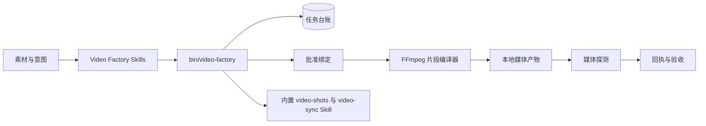
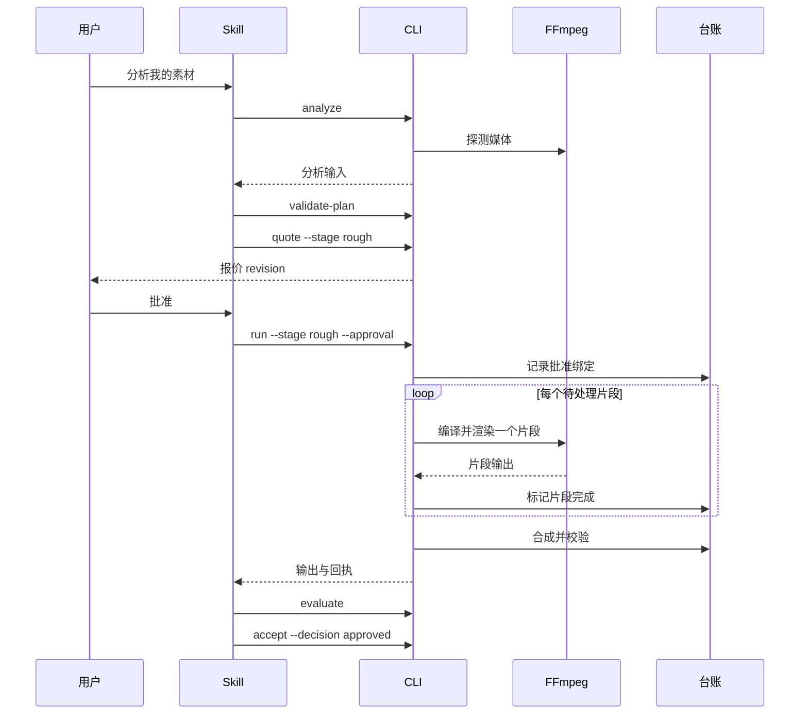

# Video Factory 插件架构

> **文档信息**
>
> | 字段 | 值 |
> |---|---|
> | 状态 | `0.1.0` 已实现；原生视频生成按设计保持封锁 |
> | 范围 | 本插件如何把素材变成经批准、可恢复、可核验的剪辑 |
> | 读者 | 本插件的维护者、审阅者与集成者 |
> | 不在范围 | 远端视频生成、图形工作台与项目管理 |
> | 运行证据 | [docs/verification/runtime.md](verification/runtime.md) |
> | 最近一次结构修订 | 2026-09-14 |

[English](Video-Factory-Plugin-Architecture.md) | [简体中文](Video-Factory-Plugin-Architecture.zh_CN.md)

## 1. 执行摘要

`video-factory` 把已有素材变成一次经批准、可核验的剪辑。Codex 分析镜头、提出剪辑决策、按阶段征求批准，通过本地 FFmpeg 渲染，并为每个输出文件生成回执。没有云服务、没有 API Key、也不做供应商上传。

架构存在的意义，是让三条保证在代码里可被强制：剪辑无法从聊天记录复现，所以它是一份文档；渲染不能用退出码背书，所以它必须被校验；长渲染不能从零重来，所以它必须可恢复。

## 2. 驱动力与约束

| 驱动力 | 对架构的后果 |
|---|---|
| 剪辑必须可复现 | 封闭的 `EditDecision` 编译为确定的 FFmpeg argv |
| 花费与批准不能混 | 先有一次免费报价，再有一次绑定内容哈希的批准 |
| 渲染比会话活得更久 | 可持久台账与逐段恢复，且不自动重试 |
| 输出在被校验之前只是声明 | 媒体探测与人工验收共同产出最终回执 |
| 本机是唯一执行引擎 | 直接调用 FFmpeg；不存在任何外部生成 API |

### 非目标

- 使用远端模型生成视频。`0.1.0` 中原生视频生成保持封锁，插件不得悄悄切换到 API、网页或第三方供应商。
- 生成图片或控制 Blender。那些插件交付经过授权的带哈希素材，由本插件消费。
- 提供工作台、项目管理或审阅界面。这些由 PartMe Studio 负责。
- 机械判定语义一致性。该条目记为 `NOT_RUN`，交由 Codex 或人工审阅。

## 3. 上下文与信任边界



| 边界 | 内部 | 外部 |
|---|---|---|
| 本仓库 | CLI、编排、编译器、台账、批准、探测、Skills | 远端生成 |
| FFmpeg 与 ffprobe | 编码、探测、合成 | 任何"该渲染什么"的决策 |
| 宿主 | 文件系统，以及增强审阅所需的 Chrome | 绝不写到选定根目录之外 |

| 组件 | 负责 | 不负责 |
|---|---|---|
| `src/cli.mjs` | 命令分发、退出码、参数校验 | 媒体处理 |
| `src/orchestrator.mjs` | run/approve/recover 的时序编排 | FFmpeg argv 构造 |
| `src/ffmpeg-compiler.mjs` | 确定性 argv 与内容寻址的片段键 | 批准决策 |
| `src/job-ledger.mjs` | 持久状态、原子写、恢复点 | 渲染执行 |
| `src/approval.mjs` | 把批准绑定到 stage、plan、edit、round 与 quote 哈希 | 成本估算 |
| `skills/`（7 个） | 路由、规划、审阅与恢复指令 | 运行时行为 |

## 4. 当前状态、目标状态与差距

| 能力 | 当前 | 目标 | 差距 |
|---|---|---|---|
| 拉片分析 | 已实现 | 不变 | 无 |
| 剪辑规划与报价 | 已实现 | 不变 | 无 |
| 可恢复的本地合成 | 已实现 | 不变 | 无 |
| 媒体校验与验收回执 | 已实现 | 不变 | 无 |
| 字幕烧录 | `SKIPPED`；本地 FFmpeg 9.0.1 无 libass 滤镜 | 工具链提供前不变 | 工具链能力 |
| 语义一致性 | `NOT_RUN`，由 Codex 或人工审阅 | 不变 | 有意不自动化 |
| 原生视频生成 | `0.1.0` 中封锁 | 按设计封锁 | 需要一次独立的产品决策 |

## 5. 原则与决策

| 决策 | 理由 | 反转条件 |
|---|---|---|
| 剪辑是一份封闭文档 | 聊天记录无法重跑，也无法审计 | 无 |
| 批准绑定内容哈希 | 针对一次剪辑的批准不得授权另一次 | 无 |
| 任何地方都不自动重试 | 源码写得很直白：静默重试就是"一个坏 prompt 变成一张大账单"的成因 | 若校验器能证明渲染幂等 |
| 片段工作内容寻址 | 重跑计划绝不能重渲已完成的工作 | 无 |
| 输入受限在 `--input-root` | 插件不得读取任意本地路径 | 无 |
| 远端生成不进本插件 | 它会引入本插件并不持有的凭据与计费关系 | 明确的、新增独立通道的产品决策 |

## 6. 运行期与核心流程



### 失败与恢复语义

| 失败 | 检测方式 | 行为 | 恢复 |
|---|---|---|---|
| 计划非法 | `validate-plan` | 在任何渲染之前拒绝 | 修正计划 |
| 缺少批准 | 批准检查 | 运行拒绝启动 | 重新报价并批准新的 revision |
| 素材、剪辑或规格变化 | 哈希比对 | 旧批准失效 | 重新报价并重新批准 |
| 片段失败 | 工具退出码非零 | 片段报告为失败；自动重试已禁用 | 执行 `recover` |
| 运行被中断 | 台账状态 | 已完成片段被保留 | `recover` 只续跑待处理片段 |
| 媒体校验失败 | 探测结果 | 报告为失败 | 重渲受影响的片段 |
| 请求字幕烧录 | FFmpeg 能力探测 | 该步骤记为 `SKIPPED` | 安装带 libass 的构建，或接受该缺口 |

## 7. 状态、数据与协议

| 数据 | 所有者 | 位置 | 一致性 |
|---|---|---|---|
| 任务台账 | 本插件 | `--ledger` 路径，或 `<plan>.job.json` | 经 `fsyncSync` 与 `renameSync` 的原子写 |
| 逐段状态 | 台账 | 台账内部 | Pending、Completed 或 Failed |
| 批准记录 | 批准模块 | 台账内部 | 绑定 stage、plan hash、edit hash、round、报价 revision |
| 渲染产物 | 本插件 | 选定的输出目录 | 验收前经探测校验 |
| 源素材 | 用户 | 用户自己的目录 | 不被改动 |

运行状态：`AwaitingApproval`、`Running`、`Partial`、`Collecting`、`Verifying`、`Blocked`、`Failed`、`ReviewReady`、`Completed`、`ReworkReady`。

命令面是 CLI 加上稳定退出码：`0` 成功、`1` 一般错误、`2` 未知命令、`3` 仅支持本地合成、`4` 批准错误。

## 8. 安全

- 本插件不含任何 API Key、Token 或凭据，运行时也不会读取。
- 生成过程不发起任何网络请求；本地 FFmpeg 是唯一执行引擎。
- 批准绑定内容哈希，因此无法把一次批准重放到不同内容上。
- 输入边界会拒绝 `--input-root` 之外的路径、符号链接逃逸与特殊文件。
- 插件不提供图形工作台、不生成图片、不控制 Blender，也不调用外部视频 API。

## 9. 资源与运行预算

| 预算 | 值 | 理由 |
|---|---|---|
| 付费或远端调用 | 零 | 插件完全没有远端通道 |
| 批准范围 | 一个阶段、一个报价 revision | 后续阶段或 revision 需要各自的决策 |
| 重试策略 | 不自动重试 | 重试无法证明渲染幂等 |
| 片段标识 | 内容寻址 | 让续跑在无需重渲的前提下安全 |
| 运行时依赖数 | 零个 npm 包 | CLI 在用户已有的 Node 中直接运行 |

### 运行

```bash
node --test tests/*.test.mjs
bin/video-factory probe
bin/video-factory status video-plan.json
```

## 10. 部署、兼容性与演进

插件以 Codex 插件形态发布，运行时是一个内置 CLI。没有守护进程、没有服务、没有网络监听。CI 在 Node 18 与 Node 24 上跑测试套件。

| 方面 | 立场 |
|---|---|
| Node | 18 或更新 |
| 媒体工具链 | `PATH` 上的 FFmpeg 与 ffprobe |
| Chrome | 可选，用于增强的 `video-sync` 审阅 |
| 回滚 | 回退插件即可；回执格式可追加，台账仍可读取 |

| 风险 | 缓解 |
|---|---|
| 中断的渲染重复工作 | 内容寻址片段与台账驱动的续跑 |
| 过期批准授权了另一次剪辑 | 批准绑定 stage、plan、edit、round 与报价 revision |
| 缺失的工具链步骤被隐藏 | 缺失能力记为 `SKIPPED` 或 `NOT_RUN`，绝不记为成功 |
| 范围向远端生成蔓延 | 该边界被写为非目标 |

## 11. 演进接缝

- **第二个合成后端。** `src/ffmpeg-compiler.mjs` 是唯一构造编码 argv 的模块；另一个后端可以放在同一套台账与批准绑定之后。
- **更丰富的审阅信号。** 审阅路径已经产出内部审阅视频；新增信号应扩展评测阶段，而不是渲染阶段。
- **语义自动化。** 若出现可靠的语义检查，`NOT_RUN` 那条可以被实测证据替换。

## 12. 证据映射

| 断言 | 证据 |
|---|---|
| CLI 界面与退出码 | `src/cli.mjs` |
| 批准绑定 | `src/approval.mjs` |
| 续跑与台账格式 | `src/job-ledger.mjs` |
| 离线与运行状态 | [docs/verification/offline.md](verification/offline.md)、[docs/verification/runtime.md](verification/runtime.md) |
| 复审与 TRACE 记录 | [docs/verification/code-review.md](verification/code-review.md)、[docs/verification/trace-report.md](verification/trace-report.md) |
| 内置 Skill 来源 | [docs/compliance/reelbench-license-review.md](compliance/reelbench-license-review.md) |
