# Codex Video Factory 0.1.0 自动剪辑实施计划

状态：实施与发布门禁阶段

规格事实源：`docs/superpowers/specs/2026-09-14-codex-video-factory-plugin-design.md`

方法：Superpowers executing-plans、TDD、独立提交、完成前验证

## 目标

构建一个可分发的 Codex 插件：原样使用 ReelBench 完成拉片与同步审阅，由 Codex 形成
`EditDecision`，在本机用确定性 FFmpeg 生成可批准、可恢复、可验收的粗剪与终版。0.1.0 不调用
外部视频生成 API，不读取 API Key，不拥有 PartMe Studio、Image Factory 或 Blender 私有能力。

## 架构

```mermaid
flowchart LR
    A[授权素材与剪辑目标] --> S[video-shots 原样 Skill]
    S --> E[shots / track / frames / hash manifest]
    E --> D[Codex EditDecision]
    D --> V[闭合 Schema 与时间线校验]
    V --> Q[粗剪报价与批准]
    Q --> R[内容寻址 FFmpeg 粗剪]
    R --> Y[video-sync 原样 Skill]
    Y --> H[用户审阅与新 revision]
    H --> F[终版报价与批准]
    F --> M[多轨/字幕/水印终版]
    M --> G[媒体 Harness]
    G --> C[显式人工 accept]
```

## 全局约束

- 项目标识统一使用 `codex-video-factory-plugin`、`codex-video-factory` 和 `video-factory`。
- ReelBench 固定提交 `75520c7b32ab5af8b22c5e4f79705efbbc0d8e07`；27 个文件禁止修改。
- Node.js 18+、FFmpeg/ffprobe 必需；Chrome 只对同步审阅必需；零 npm 运行依赖。
- 只接受授权根内普通本地文件，拒绝 URL、符号链接逃逸、特殊文件和任意 filter graph。
- 失败不自动重试；旧产物不覆盖；`PASS/FAIL/SKIPPED/NOT_RUN` 分开记录。
- 粗剪和终版分别报价批准；渲染完成不等于用户接受，必须显式 `accept`。

## 任务清单与当前证据

### Task 1：修订规格和现有计划

- [x] 定位为“视频生成编排、自动剪辑、视频合成与成片质量工厂”。
- [x] ReelBench 原样激活进入 0.1.0，删除自研拉片/同步审阅重复职责。
- [x] 保持单一设计规格和本实施计划。

### Task 2：建立插件分发骨架

- [x] Codex manifest、Marketplace 清单、Node ESM package 和可执行 CLI。
- [x] 七个活跃 Skills；Node.js 18+；零 npm 依赖、零 API Key。

### Task 3：原样导入 ReelBench

- [x] `video-shots` 15 文件、`video-sync` 12 文件逐字节导入。
- [x] Git Blob + SHA-256 双锁、Apache-2.0 副本和第三方通知。
- [x] 449 + 122 项上游自测及许可证工程审查。

### Task 4：插件所有权与触发门禁

- [x] 拉片 → `video-shots`；同步审阅 → `video-sync`；剪辑/终版 → Factory。
- [x] Factory Skills 不复制上游脚本，原生视频生成在 0.1.0 明确 blocked。

### Task 5：素材与剪辑契约

- [x] Asset、Evidence、EditDecision、Plan、Approval、Job、Receipt、Scores 八类闭合 Schema。
- [x] 有理 timebase、整数 ticks、唯一 ID、边界、重叠、悬空引用和未知字段校验。
- [x] Schema `$defs/$ref` 在运行时执行，不只是文档。

### Task 6：安全素材登记与跨插件交接

- [x] 本地路径授权、SHA-256、特殊文件和符号链接防护。
- [x] Image Factory/Blender 公开回执来源、路径、类型与哈希对账。
- [x] 缺素材在渲染前原子输出 `asset-requirements.json`。

### Task 7：ReelBench 执行适配器

- [x] 仅通过 argv 执行原样脚本，不 import 上游内部函数。
- [x] seed、track、关键帧、双联系表、Codex 标注后 validate、Markdown/HTML render。
- [x] 逐文件证据哈希、原始 stdout/stderr、退出状态和真实短视频验收。

### Task 8：Codex 自动剪辑规划

- [x] EditDecision 支持裁切、排序、图片镜头、硬切、淡入淡出、叠化和五类图片运动。
- [x] 新 revision 不覆盖旧决定，输出 changed/removed 结构化 diff。

### Task 9：台账、报价和双阶段批准

- [x] 报价包含镜头数、有效总时长、输出像素、临时空间和远程调用数 0。
- [x] 批准绑定 stage、plan/edit hash、round 和 quote revision。
- [x] 原子台账、单调 revision、失败一次记录、Pending 恢复和显式人工接受。

### Task 10：FFmpeg 粗剪

- [x] 内容寻址分段、图片/视频归一化、720p CRF 28 veryfast 粗剪。
- [x] 分段独立回执；未变镜头复用；篡改缓存重渲；无任意滤镜透传。

### Task 11：原样调用 video-sync

- [x] 原始脚本生成内部同步审阅版，保存执行证据并原子发布媒体回执。
- [x] Chrome 缺失只阻塞增强审阅；无音轨输入在适配器边界被拒绝。

### Task 12：审片反馈与精剪版本

- [x] 删除、更新、移动操作形成新 EditDecision revision 和 diff。
- [x] 单镜头修改真实验收：未变镜头 0 次新渲染，变更镜头 1 次。
- [x] 旧决定、分段、粗剪和回执保持可回退。

### Task 13：终版与音视频合成

- [x] 16:9、9:16、1:1；H.264、yuv420p、30 fps、AAC 48 kHz、CRF 20。
- [x] 旁白、对白、音乐、环境声角色轨；增益、时间偏移、混音、字幕轨、水印和标题 metadata。
- [x] 标题卡作为带回执的图片镜头交接，不在插件内调用图片生成器。
- [x] 本机无 libass 时字幕用 mov_text；烧录安全区保持 `SKIPPED`，不得冒充 PASS。

### Task 14：成片质量 Harness

- [x] 14 个必需门均有独立击穿测试：文件、哈希、解码、视频流、时长、尺寸、帧率、音轨、
  时间线、来源、容器、视频编码、像素格式和音频格式。
- [x] 黑帧、冻结、静音、字幕越界、声画偏移、重复镜头和节奏策略门。
- [x] 确定性失败与人工驳回均不能被模型覆盖；语义证据缺失为 `NOT_RUN`。

### Task 15：文档、真实验收与发布门禁

- [x] 中英文 README、CLI 手册、隐私、条款、许可证、变更记录和第三方通知。
- [x] 真实验收：多段视频、六图片故事、Blender 回执、拉片、同步审阅、单镜修改、三画幅、恢复。
- [x] Factory Skills TRACE 确定性评测已记录，未对低分做美化。
- [x] 功能分支已同步远端，本地/tracking/remote SHA 一致。
- [x] 已本地集成 main。
- [x] main 已推送，`v0.1.0` Release 已发布。
- [x] 从远端 Marketplace 新缓存安装并核对源码/缓存哈希。
- [x] 用户人工连续播放同步审阅版和终版并确认。
- [ ] 用户人工连续播放六图故事粗剪并确认。

## 完成门禁

- [x] 61 项项目测试通过，0 失败。
- [x] 27/27 ReelBench 文件双哈希一致，449 + 122 项上游断言通过。
- [x] Plugin validator 与 5 个 Factory Skill quick validation 通过。
- [x] 真实 FFmpeg/ffprobe/Chrome 运行，不以 mock 代替媒体链。
- [x] 活跃代码无外部视频 API、API Key、shell:true、网络输入或自动重试。
- [x] 功能分支三方 SHA（本地、tracking、remote）一致。
- [x] GitHub Actions Node 18/24 真实媒体 CI 通过。
- [x] 主分支发布后三方 SHA 一致。
- [x] 两条独立代码审查通道返回证据：代码/安全 APPROVE，架构 WATCH，无合并阻断。
- [x] 新 Marketplace 缓存安装、启用和 CLI 发现通过。
- [x] 同步审阅版与终版人工播放结果由用户明确记录。
- [ ] 六图故事粗剪人工播放结果由用户明确记录。

未完成的门必须保持未勾选，不能因代码或测试全绿而宣称 Marketplace 已发布。
