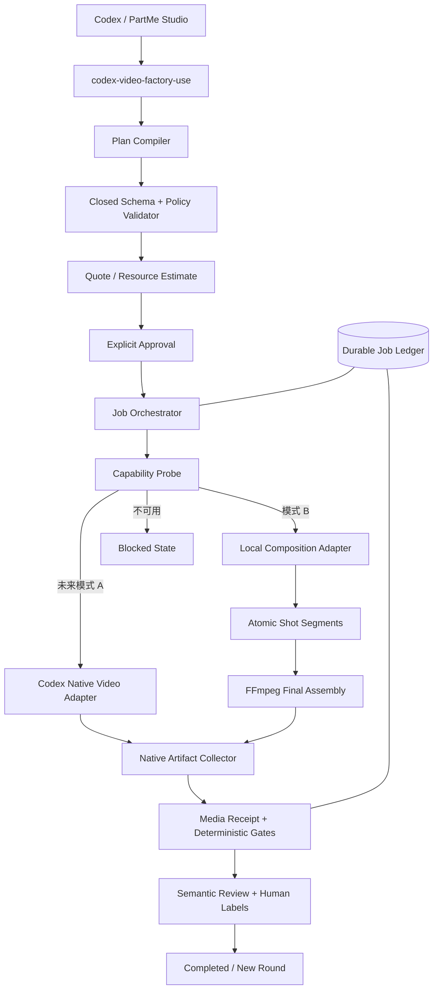
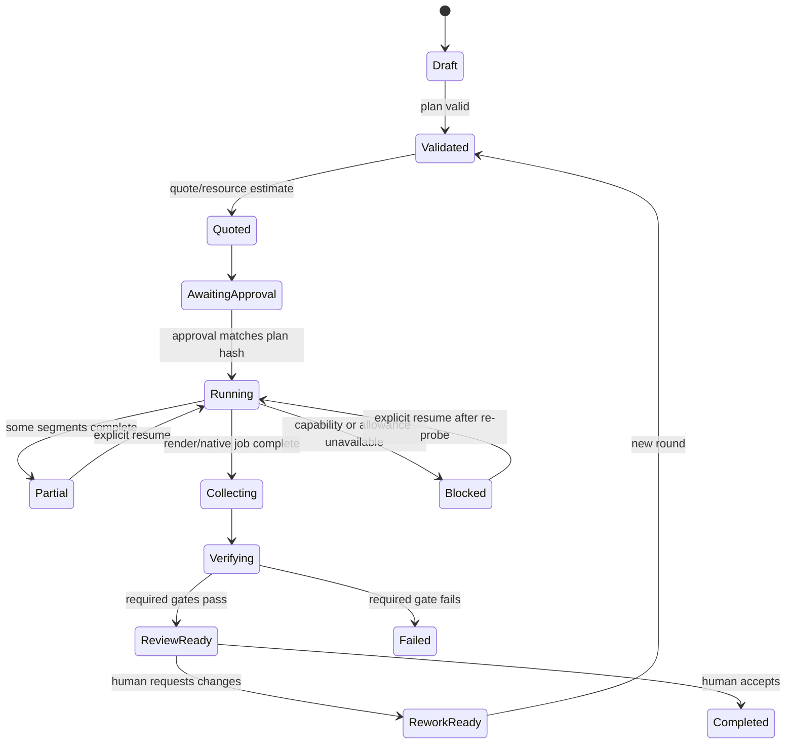

# Codex Video Factory Plugin 设计规格

> 状态：设计已确认，进入 0.1.0 实施。
>
> 日期：2026-09-14。
>
> 仓库、插件、CLI 与 Skill 统一使用规范的 `video` 拼写。

## 1. 产品定义

`codex-video-factory-plugin` 是 Codex 驱动的视频生成编排、自动剪辑、视频合成与成片质量工厂。
它接收剪辑目标和授权素材，通过拉片生成证据，由 Codex 形成 EditDecision，再生成粗剪、
同步审阅版、终版和媒体回执。

首版交付模式 B：Codex 负责编排与语义判断，本机 FFmpeg/ffprobe 负责确定性的视频制作、
测量和核验。未来模式 A 只在 Codex 真正暴露原生视频生成工具后启用；没有可验证能力时
必须保持 blocked，不能静默改用 API、网页或第三方供应商。

“生成视频”必须标明实际生产模式：

- `local_composition`：图片、视频片段、字幕和音频经本地确定性制作形成视频；
- `codex_native_generation`：未来 Codex 原生视频工具直接生成或编辑连续运动视频；
- `external_artifact_assembly`：消费其他已授权插件生成的视频素材并完成成片装配。

本插件不能把本地图片推拉、幻灯片或已有视频拼接宣传为原生 AI 文生视频。

## 2. 所有权边界

| 能力 | 所有者 | 本插件关系 |
| --- | --- | --- |
| 工作台、项目、时间线 UI、审片 | PartMe Studio | 通过公开契约调用本插件 |
| 图片生成与图片回执 | `codex-image-factory-plugin` | 消费其已批准图片产物 |
| Blender 场景、相机、动画和渲染 | `codex-blender-plugin` | 消费其图片序列或动画视频 |
| 剧本、导演方案和分镜 | 专业创作插件 | 作为 Video Plan 的上游输入 |
| 视频制作、媒体核验和恢复 | `codex-video-factory-plugin` | 本插件唯一核心职责 |
| 外部视频供应商 | 独立供应商插件 | 首版不接入，也不由本插件持有凭据 |

本插件没有图形工作台、项目数据库、通用聊天入口、Blender 控制器或图片生成器。
它不导入其他插件私有模块，只消费版本化计划、文件和回执。

## 3. 设计原则

1. **事实由程序测量。** 时长、分辨率、帧率、流、哈希、黑帧、冻结帧和响度由代码测量。
2. **语义由 Codex 判断。** 叙事、镜头职责、节奏、字幕含义和视觉一致性由模型或人工判断。
3. **模型结论需要对账。** 可由像素、时间轴或媒体流证明的结论必须经过确定性门禁。
4. **花费和重计算前批准。** 原生生成额度和长时间本地渲染均先报价或估算再批准。
5. **不自动重试。** 失败被记录；再次执行必须是明确恢复或新轮次。
6. **旧产物不可覆盖。** 输入、分段、成片和回执全部使用不可变版本与内容哈希。
7. **跳过不是通过。** `PASS`、`FAIL`、`SKIPPED`、`NOT_RUN` 必须分别记录。
8. **没有能力就阻塞。** 不安装软件、不读取 API Key、不切换到未批准生产通道。

## 4. 总体架构



## 5. 首版模式 B

### 5.1 输入

- 图片：PNG、JPEG、WebP；来源可为 Image Factory 或用户授权文件；
- 视频片段：MP4、MOV 或经 capability probe 支持的本地格式；
- Blender 产物：带哈希的图片序列或视频，不由本插件启动 Blender；
- 字幕：结构化字幕条目、SRT 或 ASS；
- 音频：用户音频、音乐、环境声，或 capability probe 通过的本机 TTS 产物；
- 视频计划：镜头顺序、时长、画幅、帧率、运动、转场、文字和音频关系。

网络 URL 不是首版生产输入。调用方应先在授权边界内完成下载和归档，再以本地内容哈希
引用素材。

### 5.2 支持的画面操作

- 静帧；
- Ken Burns 推近、拉远和平移；
- 安全裁切、适配、留边和背景填充；
- 视频片段入点、出点和无损/重编码拼接；
- 淡入、淡出、叠化和硬切；
- 标题卡、字幕、安全区文字和水印；
- 横版 16:9、竖版 9:16、方版 1:1；
- H.264/AAC MP4 为首个标准交付格式。

首版不支持运动插值、人物口型、生成式补帧、对象级视频编辑或连续角色动作生成。

### 5.3 音频策略

- 用户已有音轨始终优先；
- 本机 TTS 是可选适配器，缺失时不自动安装；
- TTS 缺失可以输出无旁白视频，但计划明确要求旁白时必须 blocked；
- 背景音乐、对白、旁白和环境声使用独立轨道计划；
- 混音记录增益、淡入淡出、响度测量和来源回执；
- 未授权音乐不得进入最终交付。

### 5.4 可恢复渲染

长视频不以一次不可恢复的 FFmpeg 命令完成。每个镜头先生成内容寻址的原子分段：

```text
work/<job_id>/round-<n>/
  segments/<shot_id>-<plan_hash>.mp4
  receipts/<shot_id>.json
  assembly/concat-plan.json
  final/<artifact_id>.mp4
  final/<artifact_id>.receipt.json
```

恢复时验证分段哈希和回执，仅补做缺失或失败分段。最终装配失败不删除分段，也不覆盖
上一个已采用成片。

## 6. 未来模式 A

原生适配器默认不存在。只有以下条件全部满足才可启用：

- 当前 Codex 工具清单中存在可调用的视频生成工具；
- capability probe 能在不消费额度的情况下确认可用性；
- 输入、输出、时长、尺寸和引用限制经过当前账号实测；
- 用户看见最大调用次数或额度影响并明确批准；
- 任务返回稳定 ID，可在中断后查询同一任务；
- 产物下载后进入与模式 B 相同的媒体回执和评测流程。

适配器不得直接调用独立 OpenAI Videos API、读取 `OPENAI_API_KEY`、操作 Sora 网页，或
把 Dreamina、Runway 等外部工具冒充 Codex 原生能力。

## 7. ReelBench 参考整合

参考仓库：`eternityspring/reelbench-skills`，固定提交
`75520c7b32ab5af8b22c5e4f79705efbbc0d8e07`，Apache-2.0。

采用策略：

- `video-shots` 与 `video-sync` 作为活跃 Skill 原样集成，27 个文件保持字节和提交身份；
- 保留 LICENSE、NOTICE、来源、固定 revision 和修改说明；
- `video-shots` 的切点、时长、运动曲线、联系表和质量门用于参考视频分析与成片核验；
- `video-sync` 的同步镜头面板用于生成内部审阅版，不作为客户最终视频默认样式；
- `execFileSync` argv 调用、零 npm 依赖和中英词表可以借鉴；
- 安装脚本、软链和宽泛触发词不进入本插件生产路由。

必须补齐的差距：

- ReelBench 不负责从目标生产视频；
- 没有报价、批准、台账、幂等、恢复、原子发布和内容哈希回执；
- `video-sync` 只制作“原片 + 镜头信息”审阅视频，不做正式叙事剪辑；
- 自测不运行 FFmpeg 或浏览器，只能证明纯函数和 argv 构造；
- 被跳过的质量门不能在本插件中计为完整通过。

## 8. 活跃 Skills

首版保持七个职责清晰的 Skill：

1. `codex-video-factory-use`：统一入口，根据目标和台账状态路由。
2. `codex-video-factory-plan`：把素材、拉片证据和剪辑目标转成可校验 EditDecision 与 Video Plan。
3. `codex-video-factory-run`：粗剪/终版报价、双阶段批准、分段渲染、装配和产物采集。
4. `codex-video-factory-judge`：媒体硬门禁、语义建议和人工标签。
5. `codex-video-factory-recover`：读取台账，给出唯一合法下一步，不自动重试。
6. `video-shots`：原样 ReelBench 拉片、镜头分析和报告能力。
7. `video-sync`：原样 ReelBench 同步镜头信息审阅视频能力。

Skill 只描述何时使用、输入输出、批准点和失败边界。确定性逻辑全部落在可测试脚本中。

## 9. CLI 合约

```text
bin/video-factory probe
bin/video-factory validate-plan <video-plan.json>
bin/video-factory quote <video-plan.json>
bin/video-factory run <video-plan.json> --approval <approval.json>
bin/video-factory status <job-ledger.json>
bin/video-factory verify <artifact-receipt.json>
bin/video-factory evaluate <video-plan.json> <job-ledger.json>
bin/video-factory inspect <video-file> --purpose <reference|quality|rhythm>
bin/video-factory recover <job-ledger.json>
```

首版不提供任意 FFmpeg 参数透传。每个命令使用结构化输入和封闭枚举，输出 JSON 到 stdout，
人类说明写 stderr。退出码区分参数错误、能力缺失、批准不匹配、渲染失败、媒体门禁失败和
额度/平台限制。

## 10. 数据契约

- `video_plan.schema.json`：项目引用、画布、帧率、镜头、转场、字幕、音频和交付要求；
- `video_job.schema.json`：模式、轮次、revision、状态、attempts、分段和历史；
- `video_approval.schema.json`：plan hash、round、最大远程调用数和本地资源确认；
- `media_artifact_receipt.schema.json`：路径、SHA-256、字节、容器、流、时长、画幅和编码；
- `media_scores.schema.json`：确定性门、建议评分、人工标签和最终决定；
- `shot_analysis.schema.json`：切点、镜头、运动证据、语义标注和跳过门状态。

所有 Schema 使用 JSON Schema Draft 2020-12、`additionalProperties: false`，版本字段必填。
文件路径不是身份；Artifact ID 与内容哈希共同确定不可变产物。

## 11. 状态机



`Failed` 不自动回到 Running。新 prompt、新镜头参数或重做要求必须创建新 round；同一 round
恢复只能继续未完成且幂等键相同的工作。

## 12. 媒体质量门

### 必须通过

- 产物存在且 SHA-256、字节数与回执一致；
- 容器可由 ffprobe 读取，且完整解码无错误；
- 至少一个有效视频流；
- 输出时长与计划在允许容差内；
- 分辨率、画幅、像素格式和偶数边长符合交付规格；
- 帧率与计划一致或有明确归一化记录；
- 计划要求音频时存在有效音轨；
- 镜头时间轴连续、无负时长、无未声明缺口或重叠；
- 所有输入素材都能反查授权文件和内容哈希；
- 最终文件写入目标目录后再次校验，防止验证窗口内改写。

### 策略门或提示

- 黑帧比例与片头片尾黑场；
- 冻结帧区间；
- 静音区间、峰值和响度；
- 字幕是否越过镜头或总时长；
- 声画同步抽样；
- 相邻镜头重复；
- 节奏、叙事职责、人物和视觉一致性。

会误伤艺术意图的检测默认输出提示，不直接失败；项目策略可以把特定提示升级为硬门。

## 13. 失败与恢复

| 失败 | 分类 | 恢复 |
| --- | --- | --- |
| 缺少 FFmpeg/ffprobe | `capability_unavailable` | Blocked，不自动安装 |
| 计划或 Schema 不合法 | `invalid_plan` | 修改计划后创建新 revision |
| 批准与计划哈希不符 | `approval_mismatch` | 重新报价与批准 |
| 输入文件变化 | `input_hash_mismatch` | 拒绝执行，重新归档输入 |
| 单镜头渲染失败 | `segment_failed` | 保留成功分段，明确恢复失败项 |
| 最终装配失败 | `assembly_failed` | 保留全部分段和上一版成片 |
| 磁盘不足 | `storage_exhausted` | Blocked，清理或换授权目录后恢复 |
| 原生工具额度耗尽 | `usage_limit` | 记录 reset 时间，不提交剩余项 |
| 成片硬门失败 | `verification_failed` | 保留失败产物作为证据，创建新轮次 |

## 14. 安全与隐私

- 所有路径 canonicalize，并限制在批准的输入、工作和输出根目录；
- 拒绝符号链接逃逸、`..` 穿越、设备文件、命名管道和未授权网络路径；
- FFmpeg、ffprobe、Chrome 和可选本机 TTS 一律使用 argv 数组，`shell=false`；
- 不允许调用方透传任意 filter graph、协议、demuxer、环境变量或可执行文件；
- 禁用首版不需要的 FFmpeg 网络协议，输入默认只接受本地普通文件；
- 台账和回执拒绝凭据字段，日志不记录字幕正文以外的私有项目内容；
- 默认一个重媒体任务并发，限制镜头数、输入字节、总时长、输出像素和临时空间；
- 外部工具输出是不可信数据，解析前有大小和格式限制；
- 删除临时文件不删除已采用产物，清理范围必须是本 job 的显式工作目录。

## 15. 测试与评估

### 离线单元与契约测试

- 每个 Schema 的 valid/invalid fixture；
- argv 无 shell、无网络协议、无未授权路径；
- 时间轴、转场、字幕、音频和几何编译；
- 状态机、幂等键、原子写、恢复和秘密字段拒绝；
- 每一道媒体门都有至少一个击穿用例；
- ReelBench 派生逻辑与固定快照的差异记录。

### 本地集成测试

- 生成短图片视频、混合片段视频、无声视频和带字幕/音轨视频；
- 杀死渲染进程后恢复，证明已完成分段不重做；
- 篡改输入、分段、成片和回执，证明哈希门能发现；
- 缺 FFmpeg、缺音频、磁盘不足、非法路径和损坏媒体；
- Chrome 可用/不可用时 inspect 与主生产链正确降级。

### 真实验收

- 6 张绘本图片生成 30–45 秒横版和竖版成片；
- 消费一次 `codex-blender-plugin` 图片序列或动画视频；
- 整组采用、只改一镜、恢复中断和上一版回退；
- 拉片报告、内部同步审阅版和最终客户视频职责不混淆；
- 新 Codex 会话、Marketplace 安装、源码/缓存一致性和公开安装文档验证。

测试通过不能代替真实 FFmpeg 产物、媒体回执和人工播放检查。

## 16. 分阶段交付

### 0.1.0 — 自动剪辑与本地视频生产闭环

原样 ReelBench 拉片与同步审阅、EditDecision、粗剪/终版双阶段批准、分段渲染、最终装配、
回执、硬门禁、恢复和七个活跃 Skill。

### 0.2.0 — Codex 原生视频适配器

仅在官方能力和当前账号运行证据满足第 6 节条件后实施。能力不存在时版本不得为了路线图
而添加伪适配器或成功占位。

## 17. 完成定义

- 插件只负责视频生产，不包含 PartMe Studio 或 Blender 职责；
- 首版 B 能从已批准计划生成真实 MP4，并产出可独立验证的媒体回执；
- 中断恢复不重复有效分段，失败不覆盖旧成片；
- 确定性事实和模型语义判断分工明确，跳过门不会冒充通过；
- ReelBench 来源、固定提交、许可证和修改范围完整；
- 没有 API Key、外部生成 API、自动重试或未批准通道切换；
- 文档、测试、真实运行、Marketplace 安装与新会话发现均有证据。

## 18. 当前事实状态

本仓库当前只有本设计规格。CLI、Schema、Skills、渲染器、测试、插件清单和运行证据均尚未
实现。本文不能作为产品已就绪、视频已生成或 Marketplace 已发布的证明。
